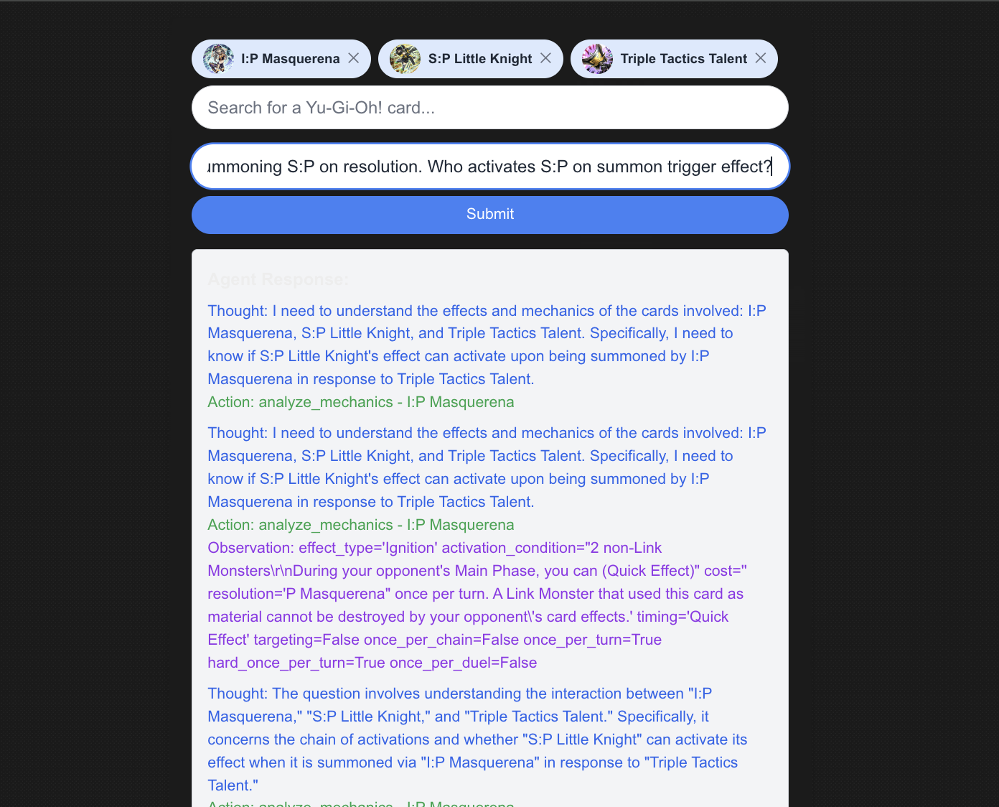
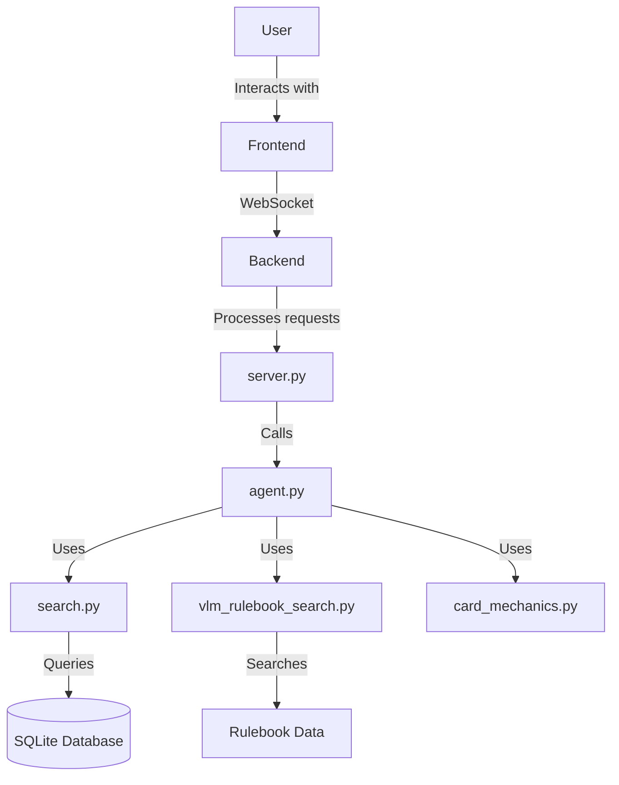

# Yu-Gi-Oh! Card Interaction and Ruling System

## Purpose
This repository contains a system designed to answer questions about Yu-Gi-Oh! card interactions and provide rulings. It consists of a backend API server, a frontend interface, and an AI agent that processes inquiries about card interactions.

*Example of the agent working through a complicated ruling*

## Repository Structure

### Backend

#### server.py
- Main FastAPI server file
- Handles WebSocket connections
- Processes card search requests and inquiries
- Integrates with the YuGiOhAgent for processing inquiries

#### agent.py
- Defines the YuGiOhAgent class
- Implements the reasoning loop for answering card interaction questions
- Utilizes OpenAI's GPT model for natural language processing
- Manages the thought process, actions, and observations of the AI agent

#### search.py
- Contains functions for searching card information and rulings
- Implements `search_card_by_name`, `get_rulings_for_question`, and `analyze_card_mechanics`
- Interacts with a SQLite database to retrieve card and ruling information

#### vlm_rulebook_search.py
- Implements `unstructured_search` function for searching the Yu-Gi-Oh! rulebook
- Utilizes vector-based search for finding relevant rules

#### card_mechanics.py
- Defines the `CardMechanic` class and `analyze_card_mechanics` function
- Extracts and analyzes the mechanical properties of Yu-Gi-Oh! cards

### Frontend

#### components/SearchBar.tsx
- React component for the main user interface
- Allows users to search for cards, select them, and submit questions
- Handles WebSocket communication with the backend
- Displays search results, selected cards, and agent responses

#### components/Inquiry.tsx
- React component for submitting inquiries about selected cards
- Integrated into the SearchBar component

#### app/page.tsx
- Next.js page component that renders the main application
- Includes the SearchBar component

### Configuration and Documentation

#### .env
- Environment variables file (not included in repository for security reasons)
- Should contain the OpenAI API key and other configuration variables

#### classes.md
- Documents the main classes used in the project, including Card, CardMechanic, Ruling, etc.

#### agent.md
- Provides detailed information about the YuGiOhAgent's design and functionality
- Explains the reasoning loop, input structure, and requirements for the agent

## Functionality

1. Card Search: Users can search for Yu-Gi-Oh! cards using the frontend interface. The backend processes these requests and returns matching cards.

2. Card Selection: Users can select cards from the search results for their inquiry.

3. Inquiry Submission: Users can submit questions about the selected cards' interactions.

4. AI Processing: The YuGiOhAgent processes the inquiry using a combination of card mechanics analysis, ruling searches, and rulebook references.

5. Real-time Response: The agent's thought process, actions, and observations are streamed back to the frontend in real-time, providing transparency into the decision-making process.

6. Final Ruling: The agent provides a final answer and ruling based on its analysis.

## Technologies Used

- Backend: Python, FastAPI, SQLite, OpenAI GPT
- Frontend: TypeScript, React, Next.js
- Communication: WebSockets
- AI: Custom agent implementation using OpenAI's GPT model

## Future Improvements

- Enhance the card database and ruling repository
- Implement user authentication and session management
- Optimize the AI agent's performance and accuracy
- Expand the system to cover more complex card interactions and scenarios

## YuGiOhAgent Breakdown

The YuGiOhAgent is the core component of the AI system that processes card interaction inquiries and provides rulings. Here's a detailed breakdown of its structure and functionality:

### Class Structure

1. **YuGiOhAgent**: The main class that encapsulates the agent's functionality.
   - Attributes:
     - `system`: The system prompt that guides the agent's behavior
     - `messages`: A list of messages representing the conversation history
     - `verbose`: A flag for detailed logging
     - `action_history`: A list of previously performed actions
     - `thinking_turns`: Counter for the number of thinking turns
     - `max_thinking_turns`: Maximum number of thinking turns allowed

2. **Supporting Pydantic Models**:
   - `Card`: Represents a Yu-Gi-Oh! card with its properties
   - `Message`: Represents a message in the conversation
   - `Action`: Represents an action the agent can take
   - `Thought`: Represents the agent's thought process
   - `Observation`: Represents the result of an action
   - `Answer`: Represents the final answer and ruling
   - `AgentResponse`: Combines thought, action, observation, and answer

### Key Methods

1. **__call__**: The main entry point for processing a question.
   - Manages the overall flow of the agent's reasoning process
   - Implements turn limits and action limits
   - Yields responses at each step for real-time feedback

2. **execute**: Sends the current conversation state to the GPT model and retrieves the response.

3. **parse_response**: Parses the GPT model's response into structured data (AgentResponse).

4. **perform_action**: Executes the chosen action (search_rulings, analyze_mechanics, or search_rulebook).

5. **has_sufficient_information**: Checks if the agent has gathered enough information to make a ruling.

6. **get_thinking_prompt**: Provides prompts for the agent's thinking turns.

7. **is_duplicate_action**: Prevents the agent from repeating the same action.

8. **execute_final_answer**: Generates the final answer and ruling.

### Reasoning Loop

1. The agent receives a question and relevant cards.
2. It enters a loop of Thought, Action, PAUSE, and Observation:
   - Thought: The agent considers the current state and decides what to do next.
   - Action: The agent performs one of three actions: search_rulings, analyze_mechanics, or search_rulebook.
   - PAUSE: The agent waits for the action to complete.
   - Observation: The agent receives and processes the result of the action.
3. This loop continues until the agent has sufficient information or reaches a turn/action limit.
4. The agent then enters a "thinking" phase to analyze the gathered information.
5. Finally, the agent provides a final answer and ruling.

### Key Features

- **Streaming Responses**: The agent yields responses at each step, allowing for real-time updates to the user.
- **Flexible Action System**: The agent can dynamically choose between different actions based on the current context.
- **Safeguards**: Implements turn limits, action limits, and duplicate action prevention to avoid infinite loops or redundant operations.
- **Structured Output**: Uses Pydantic models to ensure well-structured and type-safe data throughout the process.
- **GPT Integration**: Leverages OpenAI's GPT model for natural language understanding and generation.

### Customization and Extensibility

The agent's behavior can be customized by modifying the system prompt, adjusting the thinking prompts, or adding new action types. The modular design allows for easy extension of the agent's capabilities.

## Database Schema and Build Scripts

The Yu-Gi-Oh! Card Interaction and Ruling System relies on a SQLite database to store card information, rulings, and other relevant data. Here's an overview of the database schema and the scripts used to build and populate it:

### Database Schema

The database consists of several tables:

1. **cards**: Stores information about individual Yu-Gi-Oh! cards.
   - Columns: id, name, type, desc, race, attribute, atk, def, level, scale, linkval, linkmarkers, card_sets, card_images, card_prices, misc_info, humanReadableCardType

2. **qa_tl_fixed**: Stores Q&A-style rulings and translations.
   - Columns: qaId, locale, title, question, answer, date, sourceHash, translator, lastEditor

3. **faq_tl_entries_fixed**: Stores FAQ entries and translations for specific cards.
   - Columns: cardId, locale, effect, sourceHash, content, name

### Build Scripts

Several scripts are used to build and populate the database:

1. **db_init.py**: Initializes the SQLite database and creates the necessary tables.
   - Creates the `cards`, `qa_tl_fixed`, `faq_tl_entries_fixed`, and `rulebook_sections` tables.
   - Sets up appropriate indexes for efficient querying.

2. **card_data_importer.py**: Imports card data from the Yu-Gi-Oh! API.
   - Fetches card information from an external API.
   - Processes and inserts the data into the `cards` table.
   - Handles rate limiting and pagination of API requests.

3. **ruling_importer.py**: Imports rulings from various sources.
   - Processes ruling data from official sources and community contributions.
   - Populates the `qa_tl_fixed` and `faq_tl_entries_fixed` tables.
   - Implements data cleaning and normalization procedures.

4. **rulebook_importer.py**: Imports the Yu-Gi-Oh! rulebook content.
   - Parses the official rulebook PDF or structured data.
   - Segments the rulebook into sections and subsections.
   - Populates the `rulebook_sections` table, maintaining the hierarchical structure.

5. **data_update_script.py**: Handles periodic updates to the database.
   - Checks for new card releases and rulings.
   - Updates existing entries and adds new ones as necessary.
   - Maintains data consistency and handles conflicts.

### Data Processing and Optimization

- **Text Normalization**: All text data (card descriptions, rulings, rulebook content) undergoes normalization to ensure consistent formatting and improve search accuracy.
- **Indexing**: Appropriate indexes are created on frequently queried columns to optimize search performance.
- **Full-Text Search**: The database is configured to support full-text search capabilities, particularly for card effects and rulings.

### Maintenance and Backup

- Regular backups of the database are performed to prevent data loss.
- A maintenance script runs periodically to optimize the database, rebuild indexes, and perform integrity checks.

The database and its associated build scripts form the foundation of the system's knowledge base, enabling efficient retrieval of card information, rulings, and game rules. This structured data storage allows the YuGiOhAgent to quickly access relevant information when processing inquiries about card interactions and rulings.

## Repository Interaction Diagram

